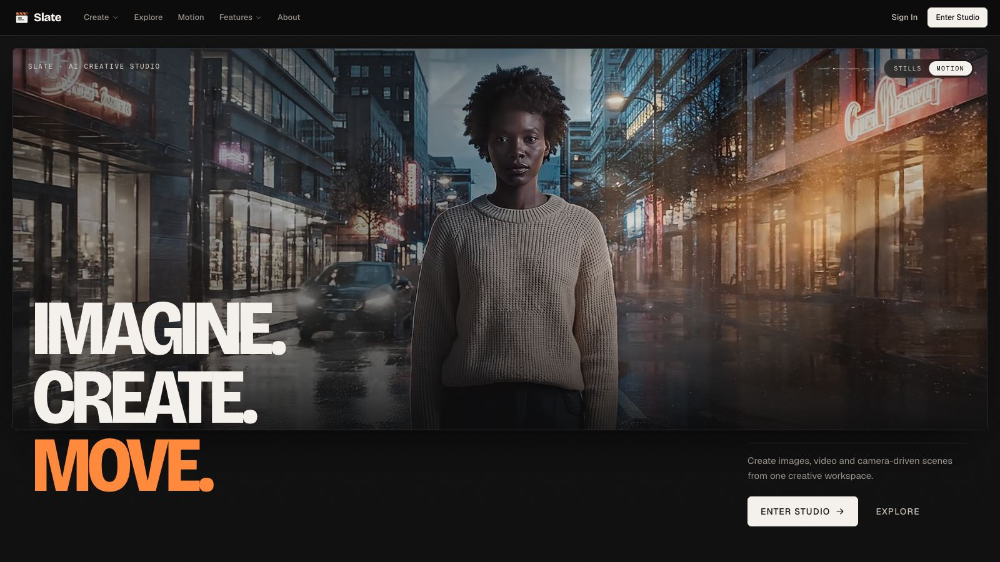
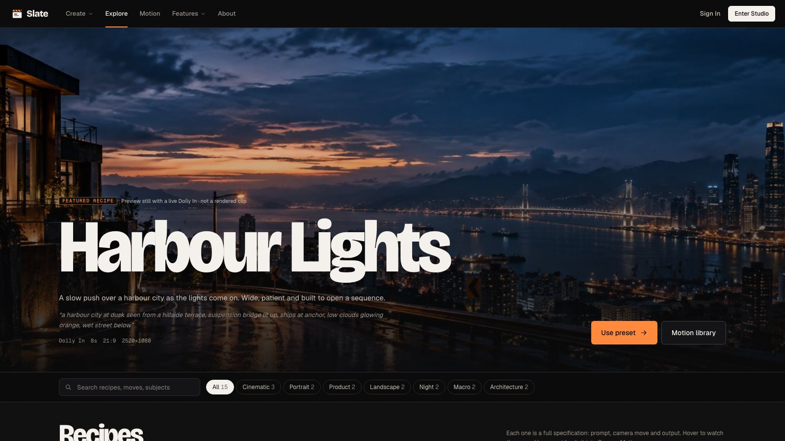
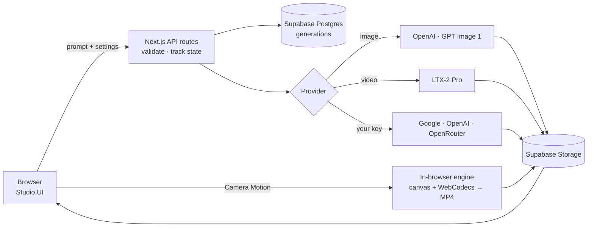

<div align="center">

# Slate

**An AI creative studio for images, video and real camera motion.**

Write a prompt, choose a model and a camera move, and get a finished, downloadable shot, all in one workspace.



</div>

---

## What is Slate?

Slate is a web app for making AI images and videos. It is inspired by [Higgsfield](https://higgsfield.ai), whose big idea is *camera-first* creation: you don't only describe a scene, you choose how the camera moves through it.

Instead of copying a whole platform, Slate focuses on **one complete journey, done properly**:

> **Prompt → Model → Settings → Generate → Progress → Result → History**

Every button does something real, every setting changes the output file, and progress is never faked.

## Features

| | What you can do |
|---|---|
| **Image** | Turn a prompt into an image with GPT Image 1, cropped exactly to one of 6 aspect ratios. |
| **Video** | Generate a 4, 6 or 8 second video with LTX-2 Pro, from a prompt or from your own image. |
| **Camera Motion** | Bring a photo and apply one of **15 real camera moves** (dolly, orbit, crane, crash zoom…). The video is rendered and encoded as an H.264 MP4 **inside your browser**. |
| **Explore** | Start from ready-made "recipes" (a prompt, a camera move and settings) with one click. |
| **History & Assets** | Everything you make is saved to your account, with download, retry and remix. |
| **Bring Your Own AI** | Connect your own Google, OpenAI or OpenRouter key and use models like **Google Veo** inside Slate. Your key is never stored. |

<details>
<summary><b>More screenshots</b></summary>
<br>



</details>

## How it works



**In plain words:** when you press **Generate**, the server checks your request and saves a *job*. The job moves through clear states (`queued → generating → completed / failed`), and the screen shows the real stage it is in. The finished file is stored, the job is marked complete, and it appears in your History.

A few design decisions worth knowing:

- **Camera Motion runs in the browser.** The camera move is drawn frame by frame on a canvas and encoded to MP4 with the browser's built-in video encoder (WebCodecs). This costs nothing to run, avoids server time limits, and makes duration, resolution and bitrate real settings.
- **One state machine controls every job,** so a job can never end up in an impossible state. If a render is abandoned, a heartbeat check marks it *failed* after 90 seconds, with a working **Retry**.
- **Renders survive navigation.** A tab-level generation manager keeps work running when you move between pages, and progress never moves backwards.
- **Long provider videos (e.g. Google Veo)** are submitted once. Only the job ID is saved, never the user's key, and the browser checks the status until the verified MP4 is ready.

## Tech stack

| Layer | Technology | Why |
|---|---|---|
| Framework | **Next.js 16** (App Router), **React 19** | Frontend and API in one project; simple deployment |
| Language | **TypeScript** (strict) | Catches mistakes early; types shared by client and server |
| Styling | **Tailwind CSS v4** | Fast, consistent design tokens |
| Validation | **Zod** | Every API request is checked before it is used |
| Database & files | **Supabase** (Postgres + Storage) | Real SQL with constraints, file storage in one service |
| Accounts | **Supabase Auth** | Secure sessions in httpOnly cookies |
| AI | **OpenAI GPT Image 1**, **LTX-2 Pro**, BYOK adapters | Images, generative video, user-owned models |
| Video engine | **Canvas + WebCodecs + mp4-muxer** | Real H.264 files made in the browser |
| Testing | **Vitest**, **Playwright** | Unit, integration and end-to-end browser tests |
| Hosting | **Vercel** | Automatic deploys from `main` |

## Project structure

```
src/
├── app/                 Pages and API routes (Next.js App Router)
│   ├── (site)/          Public pages: home, explore, motion, byok, about, contact
│   ├── studio/          The Studio: Video, Image and Camera Motion workflows
│   └── api/             generations, uploads, auth, byok, models
├── components/          UI: studio, home, byok, shell (nav, footer), ui primitives
├── lib/
│   ├── engine/          Camera-motion engine: geometry, easing, render, encode
│   ├── generation/      Job types, validation and the state machine
│   ├── providers/       Model registry (Cinematic, GPT Image, LTX)
│   ├── byok/            Bring-your-own-key adapters (Google, OpenAI, OpenRouter…)
│   ├── store/           Storage interface: Supabase in production, memory in tests
│   ├── auth/            Sessions and route guards
│   └── client/          Browser state: generation manager, API client
└── tests/               Unit and integration tests
e2e/                     End-to-end browser tests (Playwright)
supabase/schema.sql      Database schema
docs/                    Planning notes and screenshots
```

## Getting started

### Prerequisites

- **Node.js 20+** and npm
- A **Supabase** project (free tier is fine)
- API keys for **OpenAI** (images) and **LTX** (video) if you want those models

### 1. Install

```bash
git clone https://github.com/visheshjangir9/Slate.git
cd Slate
npm install
```

### 2. Configure environment variables

Create a `.env.local` file in the project root with these variables (never commit this file):

| Variable | Used for |
|---|---|
| `SUPABASE_URL` | Your Supabase project URL |
| `SUPABASE_PUBLISHABLE_KEY` | Supabase public key (sign-in) |
| `SUPABASE_SECRET_KEY` | Supabase secret key (server only) |
| `OPENAI_API_KEY` | GPT Image 1 (optional) |
| `LTXV_API_KEY` | LTX-2 Pro video (optional) |

Models without a key are shown as **Not configured** and are never swapped for another model. Camera Motion needs no API key at all.

### 3. Set up the database

Open the Supabase SQL editor and run [`supabase/schema.sql`](supabase/schema.sql). It is safe to run more than once.

### 4. Run

```bash
npm run dev
```

Open [http://localhost:3000](http://localhost:3000).

## Testing

```bash
npm test            # unit and integration tests (Vitest)
npm run test:e2e    # end-to-end browser tests (Playwright)
npm run lint        # ESLint
npx tsc --noEmit    # type check
```

- **360+ unit and integration tests** cover the state machine, API routes, authentication, the database adapter, BYOK adapters and video-file validation.
- **30+ end-to-end tests** click through the real site in a browser: every page, image generation, failure and retry, BYOK connection, mobile layouts and the contact page.
- **No real keys, no cost.** AI providers are mocked, and end-to-end tests run against a build with every secret removed, so tests are fast, free and can never leak a credential.

## Security and privacy

- Sessions are stored in **httpOnly cookies** and verified on every request.
- Every job is checked against its **owner**; other users get *not found*.
- Server API keys live only in environment variables, never in the browser, logs or database.
- **BYOK keys stay in the browser tab's memory only.** They are never saved and disappear on reload or sign-out.
- Uploaded images are validated by their **actual bytes**, and the server only calls a fixed list of provider addresses.
- Security headers are sent on every response.

## Roadmap

- [ ] Google sign-in
- [ ] More image and video models through a single aggregator (Kling, Seedance, Wan, FLUX)
- [ ] Server-side job queue for long renders
- [ ] Captions and subtitles for generated video
- [ ] Continuous integration on every pull request

## Author

**Vishesh Jangir**, built as a software engineering assignment.

[Email](mailto:visheshjangir026@gmail.com) · [LinkedIn](https://www.linkedin.com/in/vishesh-jangir-274969291/) · [GitHub](https://github.com/visheshjangir9) · [Instagram](https://www.instagram.com/vedicaai/)
